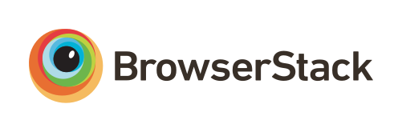

# accessmap-webapp

## Installation

## Configuration

Set the environment variables found in `set_envs.sample`.

#### Important: if running the development server, prefix all `SERVER`

variables with http://. The proxy won't work otherwise and all the servers will
break

## Sponsors / Supporters of Open Source

Continued development of AccessMap is sponsored by the Taskar Center for Accessible
Technology.

Hosting of AccessMap is sponsored by Microsoft Azure.

Cross-browser testing is supported by
 (BrowserStack).
